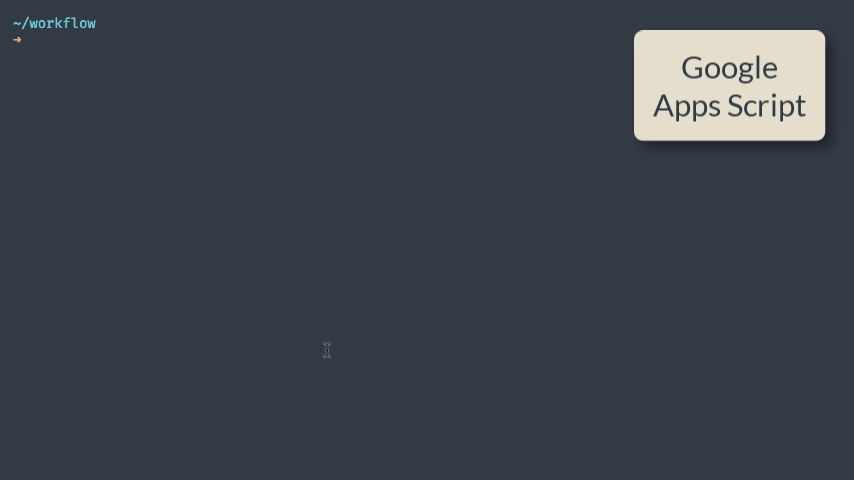

# Google Apps Script Development

This GitHub repository puts together some info and examples on developing Google Apps Script (GAS) using node.js and Clasp with VS Code.

The initial version is based on the [Apps Script Starter](https://awesomeopensource.com/project/labnol/apps-script-starter) provided by [Amit Agarwal](https://www.labnol.org/about), including the useful **[step-by-step YouTube video tutorial](https://www.youtube.com/watch?v=KxdCIbeO4Uk)**.

## Build with Google Apps Script 🚀

Setting up a modern development environment for building [Google Apps Script](https://www.labnol.org/topic/google-apps-script/) projects is easy and quick (**[video tutorial](https://www.youtube.com/watch?v=KxdCIbeO4Uk)**).

You also need to install Node.js which includes the npm package manager.

### :package: Getting Started

**1.** Clone the repository and install npm dependencies and [utilities](TOOLS.md).

```
git clone https://github.com/labnol/apps-script-starter my-project
cd my-project
npm install
```

**2.** Log in to Google clasp and authorize using your Google account.

```
npx clasp login
```

**3.** Create a new Google Script bound to a Google Sheet (or set the type as standalone to create a standalone script in your Google Drive)

```
npx clasp create --type sheets --title "My Apps Script Project" --rootDir ./dist
```

**4.** Include the necessary [OAuth Scopes](./scopes.md) in the [appsscript.json](./appsscript.json) file

1. Deploy the project (development)

```
npm run deploy
```

The `dist` directory contains the bundled code that is pushed to Google Apps Script.

**6.** Deploy the project (production mode)

```
npm run deploy:prod
```



#### Enable JavaScript v8 Runtim

Inside the Google Apps Script editor, select View > Show project manifest to open the `appsscript.json` manifest file in the editor. Add a new `runtimeVersion` field and set the value to `V8`. Save your script.


#### Development vs Production mode

In production mode, the function names and variable names are shrinked and the output code is auto-minified. The production flag is not recommended for testing and debugging the Apps Script code.

### The .claspignore file

The `.claspignore` file allows you to specify file and directories that you do not wish to not upload to your Google Apps Script project via `clasp push`.

The default `.claspignore` file in the Apps Script Starter kit will push all the JS and HTML inside the `rootDir` folder and ignore all the other files.

## Using Git with Google Apps Script

Create a new repository in Github and make a note of the URL of the new repository. Next, open the terminal and run the above commands to push your Apps Script project to Github.

# Remove all Git tracking from the project
rm -rf .git
# Initialise the local directory as a Git repository
git init
# Add files to the local repository staging area
git add .
# Commit staged files to the local repository
git commit -m "Initial commit"
# Configure remote repository
git remote add origin https://
# Push changes to remote
git push -u origin master